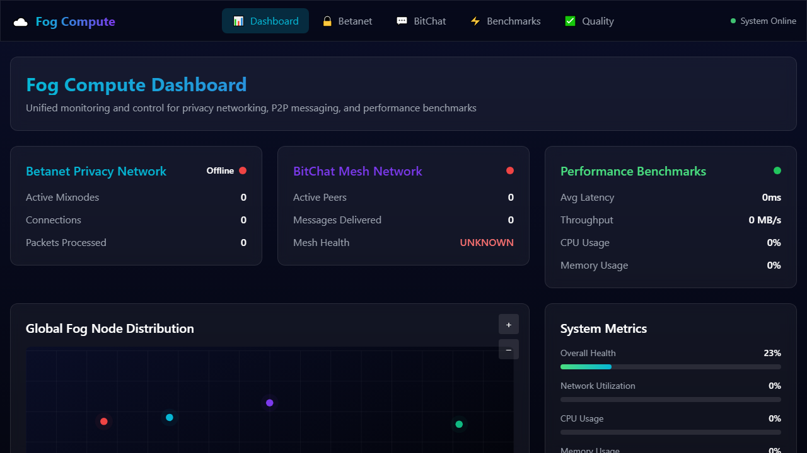
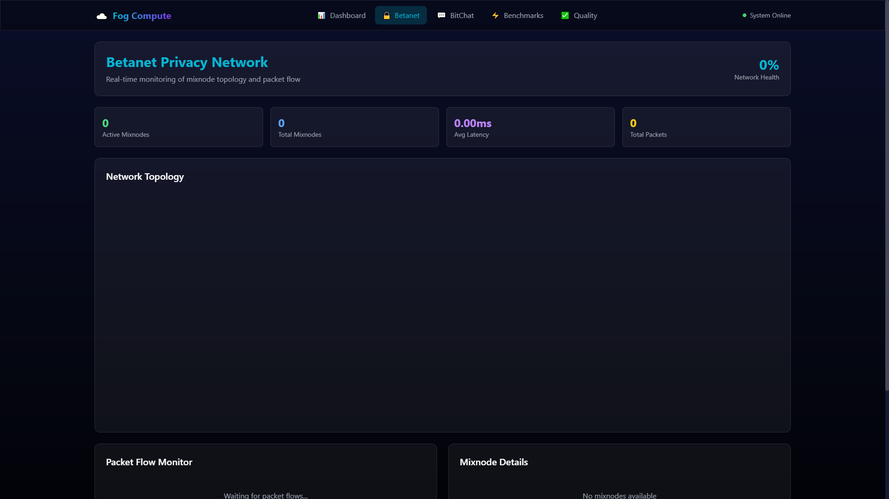
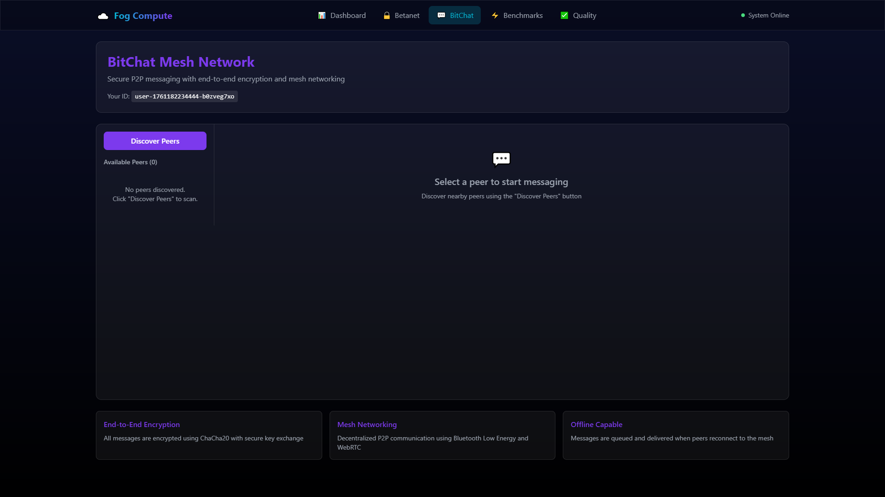
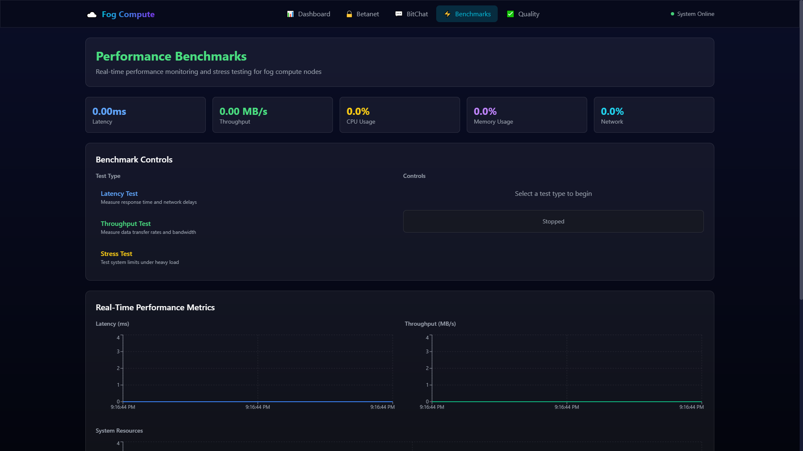
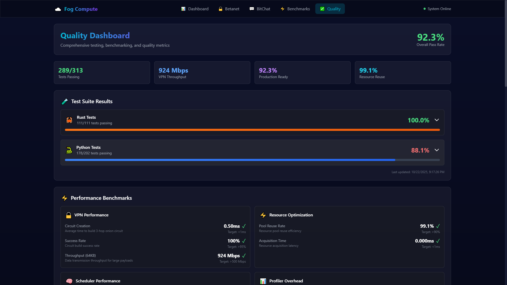

# Fog Compute Infrastructure

Complete distributed fog computing system with P2P networking, idle compute harvesting, privacy layer, and tokenomics.

## Control Panel UI

Unified web-based control panel for monitoring and managing all fog compute services.

### Dashboard

Real-time system status with BetaNet privacy network, BitChat mesh network, and performance benchmarks.

### BetaNet Privacy Network

Monitor mixnode topology, packet flow, and network latency for the privacy layer.

### BitChat P2P Messaging

Secure peer-to-peer messaging with end-to-end encryption and mesh networking.

### Performance Benchmarks

Real-time latency, throughput, CPU, memory, and network utilization metrics.

### Quality Dashboard

Comprehensive testing metrics with 92.3% pass rate (289/313 tests), VPN performance, and resource optimization.

## Core Components

### 1. **BetaNet** - Privacy-First Network
- HTX-powered privacy network for internet communication
- End-to-end encryption with onion routing
- Circuit management and node registry
- Location: `src/betanet/`

### 2. **BitChat** - P2P Messaging
- BLE-based offline P2P messaging
- Mesh networking for local communication
- Message routing and discovery
- Location: `src/bitchat/`

### 3. **P2P Unified System**
- Consolidates BitChat (BLE) + BetaNet (HTX) + Mesh protocols
- Seamless switching between online/offline modes
- Cross-protocol message routing
- Location: `src/p2p/`

### 4. **Idle Compute Harvesting**
- Mobile device compute collection during charging
- Battery and thermal-aware resource management
- Cross-platform support (Android/iOS/Desktop)
- Edge device orchestration
- Location: `src/idle/`

### 5. **VPN/Onion Routing Privacy Layer**
- Multi-layer encryption with circuit creation
- Mixnet integration for anonymity
- Privacy-preserving task routing
- Fog-native onion coordination
- Location: `src/vpn/`

### 6. **Tokenomics System**
- DAO governance with voting mechanisms
- Market-based resource pricing
- Token staking and rewards
- Decentralized marketplace
- Location: `src/tokenomics/`

### 7. **Batch Processing Scheduler**
- NSGA-II multi-objective optimization
- SLA-aware job placement
- Batch job submission and management
- Resource-aware scheduling
- Location: `src/batch/`

### 8. **Fog Infrastructure**
- Performance benchmarking suite
- Coordinator modules
- System monitoring
- Configuration management
- Location: `src/fog/`

## Quick Start

### Run Full Benchmark Suite
```bash
python src/fog/benchmarks/run_benchmarks.py --mode full
```

### Start P2P Network
```bash
python src/p2p/unified_p2p_system.py
```

### Launch Idle Compute Harvesting
```bash
python src/idle/harvest_manager.py
```

### Initialize Privacy Network
```bash
python src/vpn/fog_onion_coordinator.py
```

## Features

### Distributed Computing
- **Idle Harvesting**: Utilizes spare compute from mobile devices during charging
- **Edge Orchestration**: Manages heterogeneous edge devices
- **Resource Awareness**: Battery, thermal, and network-aware scheduling

### Privacy & Security
- **Onion Routing**: Multi-layer encryption for anonymous communication
- **VPN Integration**: Secure tunneling for fog nodes
- **Circuit Management**: Dynamic circuit creation and rotation

### P2P Networking
- **Multi-Protocol**: BLE for offline, HTX for online, Mesh for resilience
- **Seamless Handoff**: Automatic protocol switching based on connectivity
- **Message Persistence**: Store-and-forward for disconnected scenarios

### Economic Incentives
- **Token Rewards**: Compensation for compute contribution
- **DAO Governance**: Decentralized decision making
- **Market Pricing**: Dynamic resource pricing based on demand
