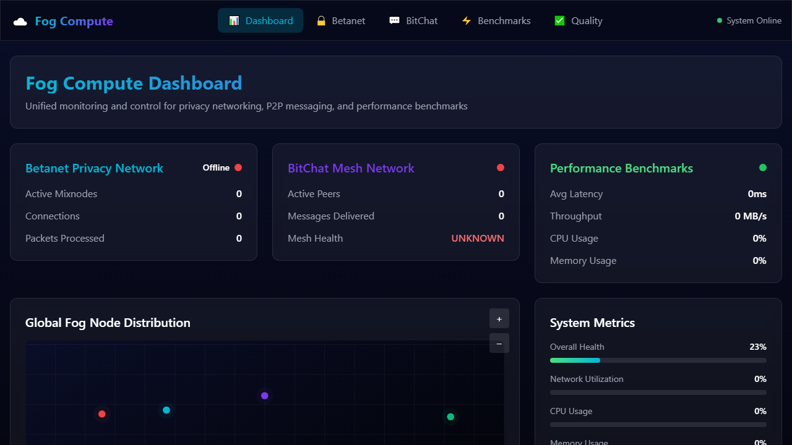
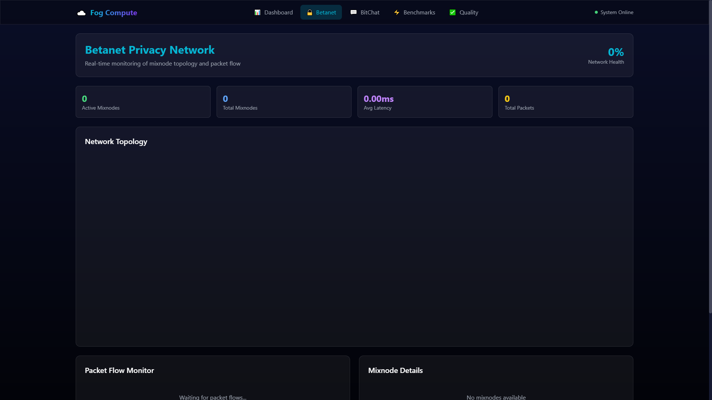
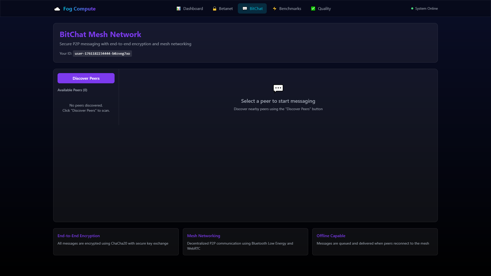
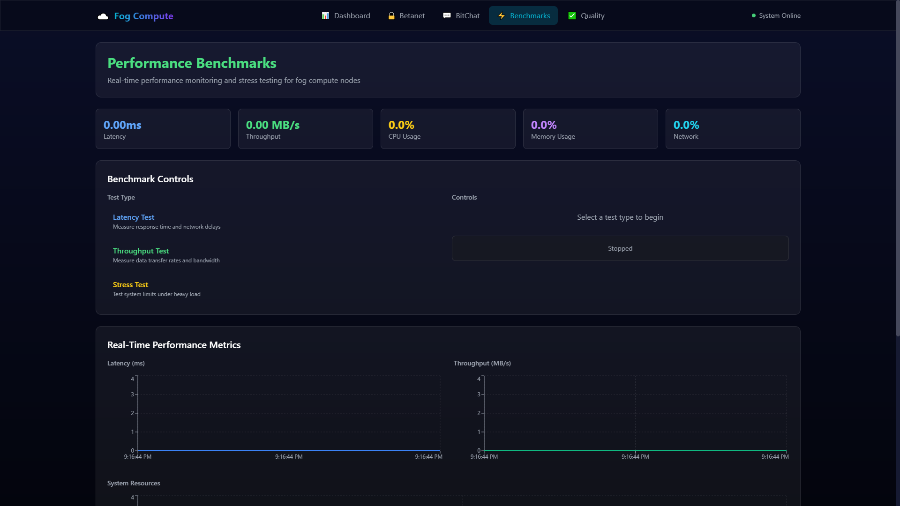
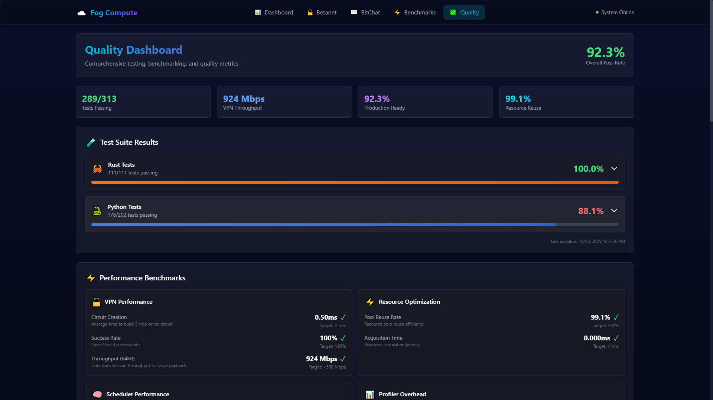

# Fog Compute Infrastructure

Fog-compute is a prototype fog-computing workspace that combines backend routes,
P2P transport experiments, scheduling components, and a control-panel UI. Several
subsystems are implemented; several privacy, mobile, and tokenomics capabilities
remain development-only or not implemented. This README is intentionally status
oriented so prototype code is not presented as shipped production infrastructure.

## Control Panel UI

The control panel exposes monitoring pages for backend services when those
services are available. Screenshots in `screenshots/` are illustrative local
captures, not production uptime evidence.

### Dashboard

Backend service status, network counters, and benchmark displays.

### BetaNet Privacy Network

BetaNet transport monitoring where the BetaNet bridge is running.

### BitChat P2P Messaging

Peer messaging and mesh-network status for the BitChat transport.

### Performance Benchmarks

Benchmark results from local benchmark runners.

### Quality Dashboard

Test and quality metrics from local suites. Treat displayed percentages as
runner output, not an external certification.

## Component Status

| Component | Status |
| --- | --- |
| BetaNet transport | Implemented as an HTX/BetaNet bridge when the supporting service is configured. |
| BitChat P2P messaging | Implemented for local/offline P2P messaging experiments. |
| Unified P2P system | Consolidates BitChat and BetaNet transports. Native mobile bridge is not implemented. |
| Idle compute harvesting | Prototype resource-management code exists. Native mobile compute harvesting is not shipped. |
| VPN/onion privacy layer | Local onion-circuit code exists. Directory consensus is simulated in development unless real authorities are configured. |
| Nym mixnet | Not implemented. The `NymMixnetClient` is a fail-closed stub and reports unavailable. |
| Tokenomics | Token balances, staking records, proposals, and rewards can be read from the DAO service. Market cap, token price, and staking APR are unavailable unless a live price feed/reward model is configured. |
| Batch processing scheduler | NSGA-II and placement code exists for scheduling experiments. |

## Quick Start

### Run Benchmark Suite
```bash
python src/fog/benchmarks/run_benchmarks.py --mode full
```

### Start P2P Network
```bash
python src/p2p/unified_p2p_system.py
```

### Launch Idle Compute Prototype
```bash
python src/idle/harvest_manager.py
```

### Initialize Privacy Coordinator
```bash
python src/vpn/fog_onion_coordinator.py
```

## Claim-Control Notes

- Mobile native bridge: not implemented.
- Mobile compute harvesting: prototype only; no shipped Android/iOS bridge.
- Nym mixnet: not implemented; stub calls fail closed in production mode.
- Onion consensus: simulated in development; no real directory-authority fetch is wired.
- Token market cap/APR: unavailable without a configured live price feed and reward-rate model.
- Marketplace activity: dashboard copy must come from live data or say unavailable.
